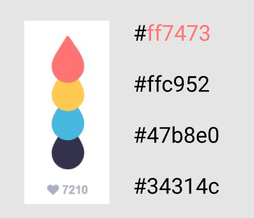
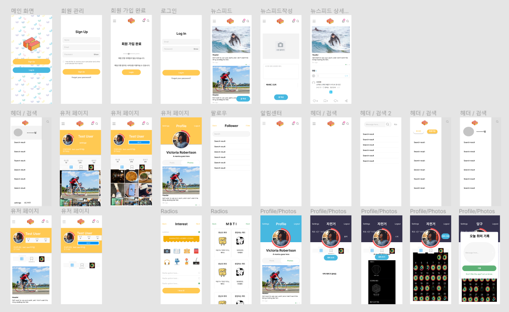
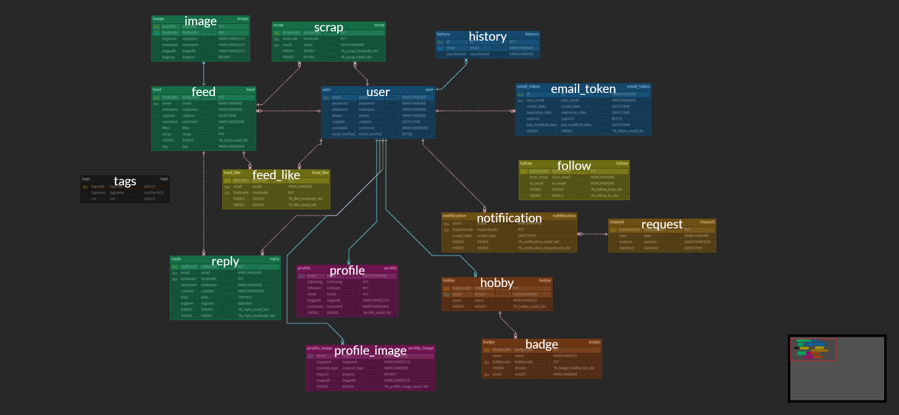

# Hobby Zoa

## 1. 프로젝트 소개

>  코로나 상황이 지속됨으로써 집에 있는 시간이 늘어나면서 새로운 취미생활을 찾는 사람들이 증가하고 있습니다. 그래서 저희는 취미공유 모바일 웹 서비스를 기획했습니다.

- Hobby Zoa(합이 좋아) 는 취미를 공유하고, 기록할 수 있는 모바일 웹 서비스입니다.

- 🏆 삼성청년SW아카데미 2학기 공통 프로젝트 우수상 🏆

## 2. 개발환경

#### Front-end

  - __Framework__ : Vue.js
  - __지원 환경__ : Web / Mobile 
  - __담당자__ : 양준영, 이혜은

#### Back-end

  - __Framework__ : Spring boot
  - __Database__ : MariaDB
  - __담당자__ : 박세영, 심지영(팀장), 추승지

#### Design

- __Framework 사용__ : O
  - Vuetify
- __담당자__ : 양준영, 이혜은

#### Design Resourses

- color : https://www.webdesignrankings.com/resources/lolcolors/

- Logo

 

## 3. 핵심라이브러리

- Sass, Vuetify, Websocket

  

## 4. 기획 및 설계

- 기획(와이어프레임)

[Figma](https://www.figma.com/file/d3976n4YmnLMj4kvd7dgyv/SSAFY-PJT?node-id=222%3A1890)

- 설계(ERD)

[ERD Cloud에서 확인하기](https://www.erdcloud.com/d/Qfmif9Qqa6xj9jZXL)

- 설계(API)

[Swagger](http://i5c102.p.ssafy.io/api/swagger-ui.html#!/)

